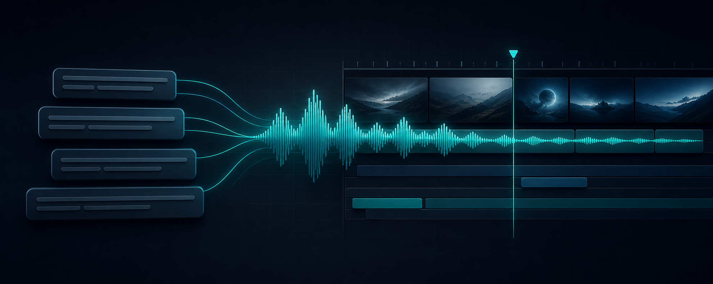

<p align="center">
  
</p>

<h1 align="center">CapDraft TTS</h1>

<p align="center">
  Tạo giọng đọc từ caption và gắn audio trực tiếp vào project CapCut.<br>
  Không copy project, không kéo thả audio thủ công.
</p>

## Tính năng

- Đọc caption trực tiếp từ `draft_content.json`.
- Lọc, tìm kiếm và chọn caption cần tạo giọng đọc.
- Hỗ trợ 129 giọng, thay đổi tốc độ và giữ/đổi cao độ.
- Cập nhật `Voice.json` online từ GitHub để thêm/sửa giọng mà không cần rebuild app.
- Cache audio, xử lý song song và hủy tác vụ an toàn.
- Tự căn đầu audio theo frame, kiểm tra tính toàn vẹn trước khi ghi.
- Backup và atomic save; rollback nếu quá trình cập nhật gặp lỗi.
- Giao diện Fluent dark mode nhất quán cùng trang Settings lưu cấu hình tự động.

## Yêu cầu

- Windows 10/11
- Python 3.10+
- CapCut Desktop và một project đã có caption
- FFmpeg/FFprobe trong `PATH`
- CapCut TTS API kèm `device.json`

## Cài đặt

### Bản Windows dựng sẵn

Tải file `CapDraft-TTS-*-windows-x64.zip` trong mục [Releases](https://github.com/KhoaDayy/CapDraft-TTS/releases), giải nén và chạy `CapDraft-TTS.exe`.

### Chạy từ source

```powershell
git clone <repository-url>
cd "CapDraft TTS"
python -m venv .venv
.\.venv\Scripts\Activate.ps1
python -m pip install -r requirements.txt
Copy-Item config.example.json config.json
python main.py
```

Mở nút **Cài đặt** (biểu tượng bánh răng ở góc dưới), sau đó chọn thư mục CapCut TTS API, `device.json`, `Voice.json` và đường dẫn FFmpeg nếu chưa có trong `PATH`.

## Cách dùng

1. Chọn thư mục project CapCut hoặc tệp `draft_content.json`.
2. Kiểm tra danh sách caption, chọn ngôn ngữ và giọng đọc.
3. Tùy chỉnh tốc độ, cao độ, cache và căn chỉnh nếu cần.
4. Chọn caption cần xử lý rồi nhấn **Tạo và gắn TTS**.
5. Mở lại project trong CapCut để kiểm tra timeline.

> [!IMPORTANT]
> Hãy đóng project trong CapCut trước khi ghi và giữ một bản sao độc lập cho dữ liệu quan trọng. Ứng dụng tự tạo backup, nhưng không thay thế chiến lược sao lưu của bạn.

## Cấu hình

`config.json` là cấu hình theo máy và được Git bỏ qua. Hãy bắt đầu từ [`config.example.json`](config.example.json). Các nhóm chính gồm:

- `capcut_tts_path`, `device_json_path`, `voice_catalog_path`: nguồn TTS và giọng.
- `voice_catalog_update_url`: URL raw GitHub dùng để cập nhật `Voice.json` trong app.
- `ffmpeg_path`, `ffprobe_path`: công cụ media.
- `tts_chunk_size`, `tts_parallel_chunks`, `tts_download_workers`: hiệu năng.
- `max_backups`: số backup tối đa giữ lại.

## Cập nhật giọng đọc online

App mặc định tải danh mục giọng từ:

```text
https://raw.githubusercontent.com/KhoaDayy/CapDraft-TTS/main/Voice.json
```

Khi muốn thêm/sửa giọng, chỉ cần cập nhật `Voice.json` trên nhánh `main` của GitHub. Trong app, mở **Cài đặt → Giọng đọc → Cập nhật từ GitHub**. App sẽ tải file mới, kiểm tra schema, backup file cũ và reload danh sách giọng ngay.

## Kiểm thử

```powershell
python -m unittest discover -s tests -v
```

## Kiến trúc

```text
main.py                         Điểm khởi chạy desktop app
core/config.py                  Cấu hình persistent
core/capcut_project/            Đọc, patch, validate và ghi project
core/capcut_tts.py              Tạo và tải audio TTS
ui/main_window.py               Workbench chính
ui/settings_dialog.py           Trang Settings
tests/                           Core + reliability tests
```

## Đóng góp

Xem [`CONTRIBUTING.md`](CONTRIBUTING.md) trước khi mở issue hoặc pull request.

## Lưu ý pháp lý

Đây là dự án độc lập, không liên kết hay được bảo trợ bởi CapCut/ByteDance. Người dùng tự chịu trách nhiệm tuân thủ điều khoản dịch vụ, quyền sử dụng giọng đọc và bản quyền nội dung. QFluentWidgets dùng GPLv3 cho mục đích phi thương mại; hãy kiểm tra giấy phép phù hợp trước khi phân phối thương mại.
